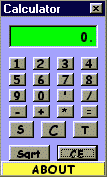



## CUTE CALCULATOR

### Description

Come and have a look at the CUTE CALCULATOR(fully functional) it even calculates basic trigonometric functions.PLEASE PLEASE PLEASE PLEASE

RATE IT.
 
### More Info
 

             |
---                |---
**Submitted On**   |2000-07-31 23:58:58
**By**             |[Gaurav Creations](https://github.com/Planet-Source-Code/PSCIndex/blob/master/ByAuthor/gaurav-creations.md)
**Level**          |Beginner
**User Rating**    |3.7 (59 globes from 16 users)
**Compatibility**  |VB 6\.0
**Category**       |[Complete Applications](https://github.com/Planet-Source-Code/PSCIndex/blob/master/ByCategory/complete-applications__1-27.md)
**World**          |[Visual Basic](https://github.com/Planet-Source-Code/PSCIndex/blob/master/ByWorld/visual-basic.md)
**Archive File**   |[CODE\_UPLOAD91988222000\.zip](https://github.com/Planet-Source-Code/gaurav-creations-cute-calculator__1-10294/archive/master.zip)

